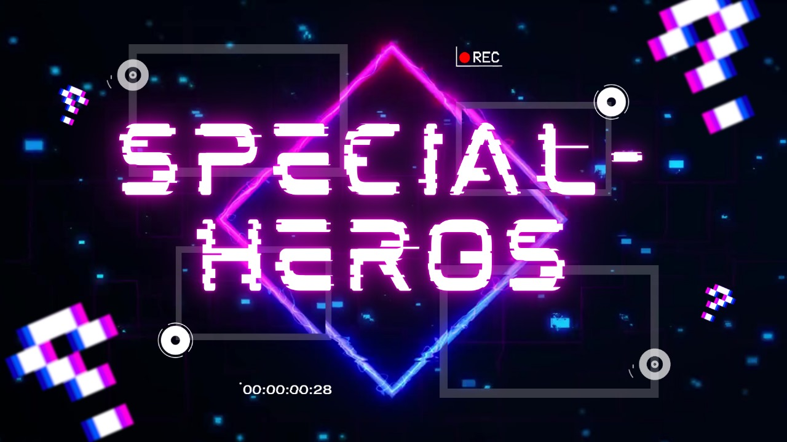

# :muscle:Special-hero

### :collision:Descripción:
Este proyecto es un juego de combate por turnos en el que los jugadores pueden seleccionar uno de varios superhéroes, cada uno con atributos y habilidades únicas, para enfrentarse a diferentes villanos en una serie de niveles progresivamente más difíciles.

### :scream: Cómo Jugar:
1. **Objetivo del Juego**: Vencer a todos los villanos, culminando en una pelea con un jefe final en el último nivel.
2. **Selecciona tu Héroe**: Puedes elegir entre 5 héroes únicos:
   - **Speed Flash**: Velocidad increíble y ataques rápidos.
   - **Iron Hammer**: Gran fuerza, pero velocidad moderada.
   - **Silent Shadow**: Maestra del sigilo y rapidez.
   - **Stone Colossus**: Un tanque con alta vida y fuerza, pero baja velocidad.
   - **Radiant Flash**: Héroe equilibrado con buena fuerza y velocidad.
3. **Turnos y Opciones**: En cada turno, puedes elegir entre atacar, recargar energía o recuperar vida.
4. **Evasión**: Los héroes con mayor velocidad tienen una mayor probabilidad de esquivar los ataques enemigos.
5. **Trampas de Villanos**: Ocasionalmente, los villanos robarán tu turno utilizando tácticas de trampa.

### :confounded:Estructura del Código:
- `Reglas`: Contiene las instrucciones del juego y controla la navegación del menú de reglas.
- `Sanar`: Calcula la cantidad de vida recuperada durante el turno de sanación del héroe.
- `SeleccionPersonaje`: Permite al jugador ver los detalles de los héroes y seleccionar uno.
- `SuperHero`: Clase que define las propiedades y métodos para los superhéroes.
- `Trampa`: Verifica si los villanos roban un turno mediante una trampa.
- `Villano`: Clase que define las propiedades y métodos para los villanos.

### :coffee:Lenguaje donde fue programado
-Java

### :eyeglasses:Ejecución:
1. Compila los archivos `App.java` y ejecuta el juego.
2. Sigue las instrucciones en pantalla para navegar por el juego y seleccionar tus acciones de combate.
   
### :pencil:Autores:
- Juan José Zambrano Manzano - 192327
- Nicoll Sofia Arevalo Caballero - 192316